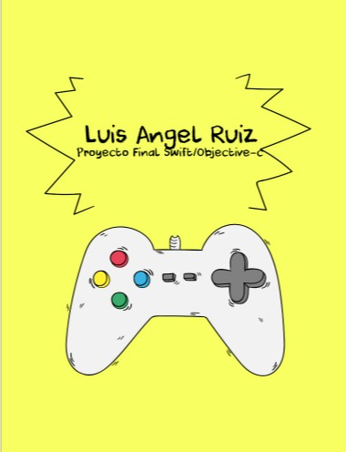
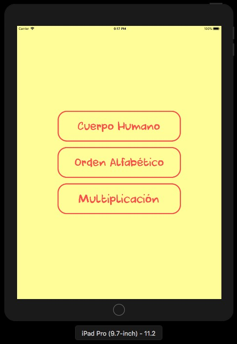
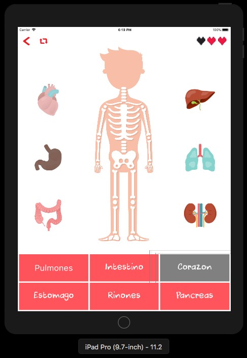
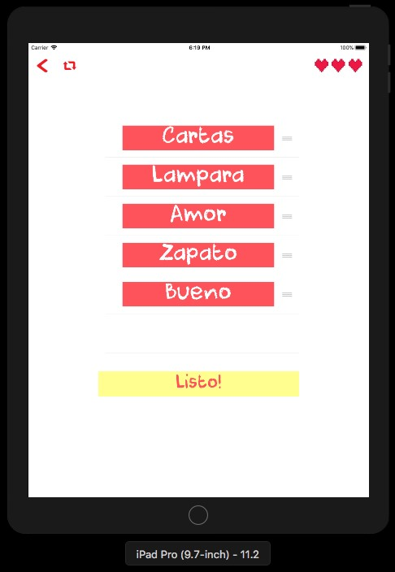
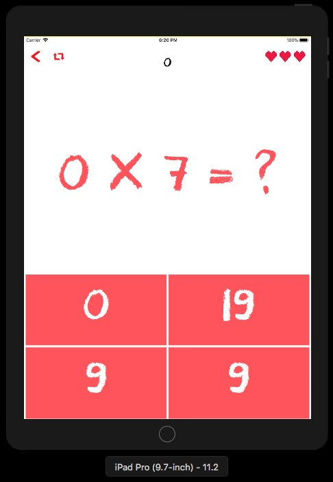
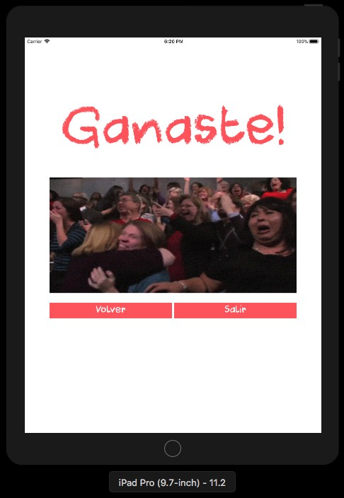

# SwiftProject
Proyecto Final Integrador Swift

Es una aplicación/juego educativo hecho en Swift para iPad, utilizando los conceptos vistos en clase como básicos 
(constantes, variables, strings, collections), auto layout, stack views, optionals, segues, MVC, tableViews, animations etc.

SplashScreen 

View principal 

Juego del cuerpo humano, se selecciona un órgano y luego se selecciona el nombre de dicho órgano

Juego del orden alfabético, se reorganizan las cells del tableview y si están en orden ganas

Juego de multiplicación, se muestran multiplicaciones random y opciones para elegir la correcta

View final dependiendo de si gana o no alguno de los 3 juegos

